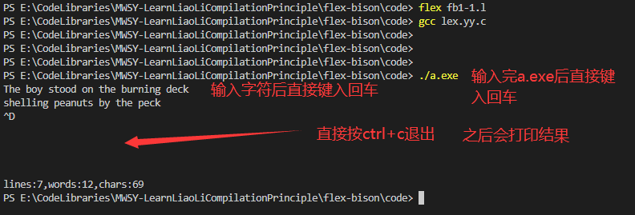
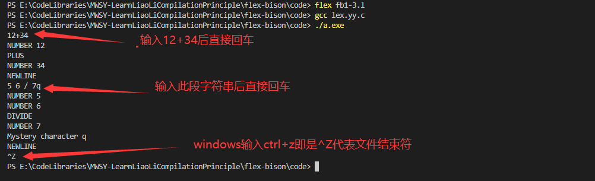

## 第1章 Flex和Bison简介

flex和bison时用来生成程序的工具，他们所生成的程序能够处理格式化输入。最初flex和bison时用来生成编译器的，但是后来他们被证明在其他很多领域也是十分有效。

### 1.1 词法分析和语法分析

最早的编译器可以追溯到20世纪50年代，这些编译器使用特别技术来分析他们所编译的源代码的语法。在60年代，这个领域获得了很多学术层面的关注，在70年代，语法分析成为一个众所周知的领域。

分析工作，被分为两个部分：词法分析与语法分析

简单来说，词法分析就是把输入分割成一个个有意义的词块，称为记号，而语法分析则确定这些记号是如何关联的。例如，看下如下的c代码片段：

```c
alpha = beta+gamma
```

词法分析器的工作即是将这段代码的输入分割成一个个有意义的一些记号：

>"alpha"  "="  "beta"  "+" "gamma"

环境配置：（我是在windows下配置环境的)

>参考该项目的lex-yacc下的一些参考资料

### 1.2 正则表达式和词法分析

词法分析通常所做的就是在输入中寻找字符的模式。例如，在c程序中，整型常量是一个或多个数字的字符串。变量名称是一个字母，后面跟着零个或多个字母和数字。而各种各样的操作符则是一个或多个的字符。一种简洁明了的模式描述方式就是正则表达式。编辑器edit和vim以及搜索程序grep就是使用这种方式来描述其所需要查找的文本。Flex程序主要有一些带有指令的正则表达式。组成这些指令确定正则表达式匹配后相应的动作。由flex生成的语法分析器可以读取输入，匹配输入，与所有的正则表达式并执行每次匹配后适当的关联动作。flex会把所有的正则表达式翻译成一种高效的内部格式。这死的他可以同时处理所有需求匹配模式。因此它的速度可以成百倍的提高。

#### 1.2.1 我们的第一个flex程序

Unix系统带了一个字数统计的程序。这个程序可以读入一个文件，然后报告这个文件的行数。单词数和字符数。Flex使我们能够仅仅利用十几行就完成这个wc程序。见例题1-1（windows下此段代码有点修改,具体请参见源文件）

例题1-1 字数统计fb1-1.l(位于code目录下，以后不在说明)

```flex
/*正如Unix的wc程序*/
%{
int chars = 0;
int words = 0;
int lines = 0;
%}

%%
[a-zA-Z]+ 	{ words++;char+=strlen(yytext);}
\n			{chars++;lines++;}
.			{chars++;}
%%

int main(int argc,char** argv)
{
	yylex();
	printf("lines:%d,words:%d,chars:%d\n",lines,words,chars);
	return 0;
}
```

这个程序大部分内容对于c程序员来说是十分熟悉的，因为这些是c代码。Flex程序包含三个部分，各个部分之间通过仅有的%%进行分割，第一个部分包含声明和选项设置。第二个部分是一系列模式和动作。第三部分则是会被拷贝到生成语法生成器里面的c代码。他们通常是一些动作相关的c程序。

在声明部分，%{ 和 %}之间的代码会被原样抄到生成的c文件的开头部分。在这个例子里面，它只是用来设定行数，单词数和字符数的变量。

在第二部分。每个模式处于一行的开头处。接着是模式匹配时所需要执行的c代码。这的c代码适用。{}括住的一行或多行语句。(模式必须在行首出现。因为flex认为以空白开始的行，都是代码。而把他们照抄到深层的c程序中。)

这个程序只有三个模式。

第一个模式,[a-zA-Z]+,用来匹配一个单词。在方括号里面的字符串是一种字符类。能够匹配任意一个大小写字母，而这个+表示匹配一个或多个前面的字符类。也就是一连串字母，或者说一个单词。相关的动作更新匹配过的单词和字数。在任意一个flex的动作中，变量yytext总是被设为指向本次匹配的输入文本。在这个例子里，我们所需要关心的是有多少个字符，因此我们可以借助这个变量来统计字数。

第二个模式。\n ,用来匹配换行符。相关的动作更新数和字符数。

最后一个模式是一个点号。他在正德表达式代表任意一个字符。关联的动作更新字符数。

这些就是我们要匹配的所有的模式。末尾的c代码是我们的主程序。他负责调用flex提供了词法分析例程yylex()，并输出结果在没有任何改变的情况下，词法分析器将读取标准输入，我们来运行一下。



#### 1.2.2 纯Flex的程序

#### 1.2.3 让Flex和Bison协同工作

我们第一个同时使用flex和benson的程序将是一个桌面计算器。首先我们编写一个词法分析器，接着我们编写一个语法分析器，并将两者结合起来。

为了让事情变了简单，我们的计算器只需要识别到整数。基本算术符和一元绝对操作符。

例1-3:一个简单的flex的词法分析器fb1-3.l

```flex
/*识别出用于计算器的记号并把它们输出*/

%{
int yywrap(void);
%}

%%
"+"			{printf("PLUS\n");};
"-" 		{printf("MINUS\n");};
"*" 		{printf("TIMES\n");};
"/" 		{printf("DIVIDE\n");};

"|" 		{printf("ABS\n");};
[0-9]+ 		{printf("NUMBER %s\n", yytext);};
\n 			{printf("NEWLINE\n");};
[ \t] 		{ };
.			{printf("Mystery character %s\n", yytext);};
%%

int yywrap(void)
{
    return 1;
}

int main(int argc,char** argv)
{
	yylex();
	return 0;
}

```

前五个模式就是操作副本三。用引号引起，而目前动作仅仅是打印出匹配内容。引号告诉flex使用引号内文本的原意，而不是将他们解释成正则表达式。

第六个模式匹配一个整数这种方，这种方括号括起的模式[0-9]+可以匹配任意一个数字。接着的"+"这个符号表示匹配一个或多个前面的项。也就是由一个或多个数字组成的字符串。相关的动作利用词法分析器每次匹配到后所设置的yy text。打印出匹配的字符串。

第七个模式匹配一个换行符，它使用c语言通常的序列:\n

第八个模式用来忽略空白符，它匹配到一个空格或者table。相关的动作，无需做任何事情。

最后一个模式用来匹配其他模式所没有匹配到的内容相关的动作打印出。恰当抱怨信息。

这九个模式提供了一定的规则来匹配用户可能的输入，随着我们继续开发器我们将添加更多的规则来匹配更多的记号，但这些已经可以作为我们的开始部分。

在这个简单的flex程序中，我们并没有第三段c代码。Flex库文件提供了一个极小的主程序来调用词法分析器。这对我们的例子已经足够。

让我们试验一下这个词法分析器



首先我们运行flex，他把尺码分机器翻译成c程序。接着我们编译这个c程序并最终运行，它输出结果表明他可以识别数字操作符以及最后一行的q（^D是unix或者Linux的文件结束符。在Windows中你可以输入^Z)


